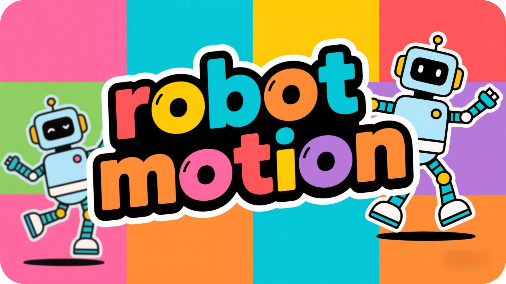

<h1 align="center">🤖 ESP32 Robot Motion</h1>

<p align="center">
RobotMotion是一个让ESP32轻松控制多舵机运动的组件<br/>
支持单舵机和多舵机并行控制<br/>
提供平滑的运动曲线和动作序列功能
</p>

<p align="center">
<a href="./README_EN.md">English</a>
· 简体中文
· <a href="https://github.com/NingZiXi/robot_motion/releases">更新日志</a>
· <a href="https://github.com/NingZiXi/robot_motion/issues">反馈问题</a>
</p>

<p align="center">
  <a href="LICENSE">
    
  </a>
  <a href="https://docs.espressif.com/projects/esp-idf/">
    
  </a>
  <a href="https://docs.espressif.com/projects/esp-idf/">
    
  </a>
  <a href="https://www.espressif.com/">
    
  </a>
  <a href="">
    
  </a>
  <a href="https://github.com/NingZiXi/robot_motion/stargazers">
    
  </a>
</p>

---
## 🚀 简介

**RobotMotion** 是一个专为ESP32设计的轻量级多舵机运动控制库✨，通过简洁的API接口实现单舵机和多舵机的平滑运动控制。支持**动作序列编程**和**JSON配置**，可轻松与Coze等大模型平台集成，通过 **Function Calling(函数调用)** 实现智能体直接控制舵机运动，非常适用于智能玩具🧸、机器人🤖等AIoT应用场景。

## 🛠️ 快速开始
## 📥 克隆项目

要将组件添加到项目中请在IDF终端执行下方命令:

```bash
idf.py add-dependency "ningzixi/robot_motion^1.0.0"
```

或者直接克隆本仓库到项目`components`目录下:

```bash
git clone https://github.com/NingZiXi/robot_motion
```

## 💻 基本用法

## 1️⃣初始化配置
```c
#include "iot_servo.h"
#include "robot_motion.h"

// 舵机初始化
servo_config_t servo_cfg = {
    .max_angle = 180,
    .min_width_us = 500,
    .max_width_us = 2500,
    .freq = 50,
    .timer_number = LEDC_TIMER_0,
    .channels = {
        .servo_pin = {
            GPIO_NUM_18, GPIO_NUM_19, GPIO_NUM_21, GPIO_NUM_22,
        },
        .ch = {
            LEDC_CHANNEL_0,
            LEDC_CHANNEL_1,
            LEDC_CHANNEL_2,
            LEDC_CHANNEL_3,
        },
    },
    .channel_number = 4,
};

ESP_ERROR_CHECK(iot_servo_init(LEDC_LOW_SPEED_MODE, &servo_cfg_ls));

// 运动控制器初始化
motion_ctrl_t controller;
motion_init(&controller);
```
## 2️⃣基本运动控制

```c
// 单舵机运动 (通道0转到90度，耗时1秒)
motion_add_single(&controller, 0, 90.0f, 1000);

// 多舵机并行运动 (3个舵机同时运动)
uint8_t channels[] = {0,1,2};
float angles[] = {45.0f, 60.0f, 30.0f};
motion_add_parallel(&controller, 3, channels, angles, 1500);
```
## 3️⃣高级功能
### 🎭动作序列执行
```c
// 预设动作序列
motion_sequence_t sequence_demo[] = {
    {1, {0,1,2,3}, {30,150,30,150}, 4, 1000, 300},
    {1, {0,1,2,3}, {150,30,150,30}, 4, 1000, 300},
    {1, {0,1,2,3}, {90,90,90,90}, 4, 800, 500},
    {1, {0,1,2,3}, {10,170,170,10}, 4, 1200, 0}
};
motion_exec_sequence(&controller, sequence_demo, sizeof(sequence_demo) / sizeof(sequence_demo[0]));
```
每一个motion_sequence_t类型的元素代表一个动作，其中：
- `type`: 动作类型，0为单舵机，1为多舵机
- `channels`: 舵机通道数组
- `target_angles`: 目标角度数组
- `duration_ms`: 动作持续时间
- `delay_after`: 动作后延迟时间

使用`motion_exec_sequence`会自动按照顺序执行动作序列，直到所有动作执行完毕。

### 📋执行JSON动作序列

#### 默认JSON格式 (详细字段名)
```c
{
  "motions": [
    {
      "type": "parallel",       // 动作类型: parallel(并行)或single(单舵机)
      "channels": [0,1,2,3],    // 舵机通道数组
      "target_angles": [90,90,90,90], // 目标角度数组
      "duration_ms": 1000,     // 动作持续时间(毫秒)
      "delay_after": 500        // 动作完成后的延迟时间(毫秒)
    },
    {
      "type": "single",
      "channel": 0,             // 单舵机通道号
      "target_angle": 45,       // 单舵机目标角度
      "duration_ms": 800,
      "delay_after": 200
    }
  ]
}
```

#### 简化版JSON格式 (短字段名)
```c
{
  "m": [
    {
      "t": "p",                // 类型: p(并行)或s(单舵机)
      "cs": [0,1,2,3],         // 通道数组
      "as": [90,90,90,90],     // 角度数组
      "d": 1000,               // 持续时间
      "w": 500                 // 等待时间
    },
    {
      "t": "s",
      "c": 0,                  // 单通道
      "a": 45,                 // 单角度
      "d": 800,
      "w": 200
    }
  ]
}
```

#### 字段对照表

| 原版字段名       | 简化字段名 | 说明                          |
|------------------|------------|-------------------------------|
| motions          | m          | 动作序列数组                  |
| type             | t          | 动作类型(parallel/p, single/s)|
| channels         | cs         | 舵机通道数组                  |
| target_angles    | as         | 目标角度数组                  |
| duration_ms      | d          | 动作持续时间(毫秒)            |
| delay_after      | w          | 动作后延迟时间(毫秒)          |
| channel          | c          | 单舵机通道号                  |
| target_angle     | a          | 单舵机目标角度                |

关于json文本到C/C++ 字符串的转换，可以使用在线工具，如 [tomeko](https://tomeko.net/online_tools/cpp_text_escape.php)。

#### 🧪示例

```c
// 使用原版JSON
const char* full_json = "..."; // 原版JSON字符串
motion_exec_json(&controller, full_json);

// 使用简化版JSON 
const char* compact_json = "..."; // 简化版JSON字符串
motion_exec_json(&controller, compact_json);
```
注意：两种格式可以混用，解析器会自动识别字段名。

更多API接口请查看[robot_motion.h](include/robot_motion.h)
## 🤝 贡献
本项目采用 MIT 许可证📜，详情请参阅 [LICENSE](LICENSE) 文件。

<p align="center">
感谢您使用 ESP32 Robot Motion！🎉<br/>
如果觉得项目不错，请给个 ⭐ Star 支持一下！
</p>

