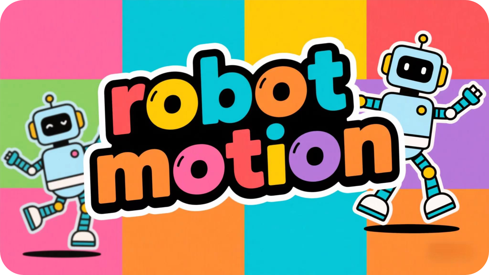

<h1 align="center">🤖 ESP32 Robot Motion</h1>

<p align="center">
A component that enables ESP32 to easily control multiple servos<br/>
Supports single and parallel servo control<br/>
Provides smooth motion curves and action sequence functionality
</p>

<p align="center">
<a href="./README.md">简体中文</a>
· English
· <a href="https://github.com/NingZiXi/robot_motion/releases">Changelog</a>
· <a href="https://github.com/NingZiXi/robot_motion/issues">Report Issues</a>
</p>

<p align="center">
  <a href="LICENSE">
    
  </a>
  <a href="https://docs.espressif.com/projects/esp-idf/">
    
  </a>
  <a href="https://docs.espressif.com/projects/esp-idf/">
    
  </a>
  <a href="https://www.espressif.com/">
    
  </a>
  <a href="">
    
  </a>
  <a href="https://github.com/NingZiXi/robot_motion/stargazers">
    
  </a>
</p>

---
## 🚀 Introduction

**RobotMotion** is a lightweight multi-servo motion control library designed for ESP32✨, providing smooth motion control for single and multiple servos through a concise API. Supports **action sequence programming📋** and **JSON configuration📄**, and can be easily integrated with platforms like Coze🤖 using **Function Calling💡** for direct AI agent control of servos. Ideal for smart toys🧸, robots🤖 and other AIoT applications.

## 🛠️ Quick Start
### 📥 Clone Project

To add this component to your project, run the following command in IDF terminal:

```bash
idf.py add-dependency "ningzixi/robot_motion^1.0.0"
```

Or clone directly to your project's `components` directory:

```bash
git clone https://github.com/NingZiXi/robot_motion
```

## 💻 Basic Usage
### 1️⃣ Initialization
```c
#include "iot_servo.h"
#include "robot_motion.h"

// Servo initialization
servo_config_t servo_cfg = {
    .max_angle = 180,
    .min_width_us = 500,
    .max_width_us = 2500,
    .freq = 50,
    .timer_number = LEDC_TIMER_0,
    .channels = {
        .servo_pin = {
            GPIO_NUM_18, GPIO_NUM_19, GPIO_NUM_21, GPIO_NUM_22,
        },
        .ch = {
            LEDC_CHANNEL_0,
            LEDC_CHANNEL_1,
            LEDC_CHANNEL_2,
            LEDC_CHANNEL_3,
        },
    },
    .channel_number = 4,
};

ESP_ERROR_CHECK(iot_servo_init(LEDC_LOW_SPEED_MODE, &servo_cfg_ls));

// Motion controller initialization
motion_ctrl_t controller;
motion_init(&controller);
```

### 2️⃣ Basic Motion Control
```c
// Single servo motion (Channel 0 to 90 degrees, 1 second duration)
motion_add_single(&controller, 0, 90.0f, 1000);

// Parallel servo motion (3 servos moving simultaneously)
uint8_t channels[] = {0,1,2};
float angles[] = {45.0f, 60.0f, 30.0f};
motion_add_parallel(&controller, 3, channels, angles, 1500);
```

### 3️⃣ Advanced Features
#### 🎭 Action Sequence Execution
```c
// Predefined action sequence
motion_sequence_t sequence_demo[] = {
    {1, {0,1,2,3}, {30,150,30,150}, 4, 1000, 300},
    {1, {0,1,2,3}, {150,30,150,30}, 4, 1000, 300},
    {1, {0,1,2,3}, {90,90,90,90}, 4, 800, 500},
    {1, {0,1,2,3}, {10,170,170,10}, 4, 1200, 0}
};
motion_exec_sequence(&controller, sequence_demo, sizeof(sequence_demo) / sizeof(sequence_demo[0]));
```

Each element of motion_sequence_t represents an action with:
- `type`: Action type (0 for single servo, 1 for multiple servos)
- `channels`: Servo channel array
- `target_angles`: Target angle array
- `duration_ms`: Action duration (ms)
- `delay_after`: Post-action delay (ms)

`motion_exec_sequence` will automatically execute the sequence in order until all actions are completed.

#### 📋 JSON Action Sequence Execution
##### Standard JSON Format (Full field names)
```json
{
  "motions": [
    {
      "type": "parallel",       // Action type: parallel or single
      "channels": [0,1,2,3],    // Servo channel array
      "target_angles": [90,90,90,90], // Target angle array
      "duration_ms": 1000,     // Action duration (ms)
      "delay_after": 500        // Post-action delay (ms)
    },
    {
      "type": "single",
      "channel": 0,             // Single servo channel
      "target_angle": 45,       // Single target angle
      "duration_ms": 800,
      "delay_after": 200
    }
  ]
}
```

##### Compact JSON Format (Short field names)
```json
{
  "m": [
    {
      "t": "p",                // Type: p(parallel) or s(single)
      "cs": [0,1,2,3],         // Channel array
      "as": [90,90,90,90],     // Angle array
      "d": 1000,               // Duration
      "w": 500                 // Wait time
    },
    {
      "t": "s",
      "c": 0,                  // Single channel
      "a": 45,                 // Single angle
      "d": 800,
      "w": 200
    }
  ]
}
```

##### Field Comparison Table
| Full Field Name | Short Field | Description                  |
|-----------------|------------|------------------------------|
| motions         | m          | Action sequence array        |
| type            | t          | Action type(parallel/p, single/s)|
| channels        | cs         | Servo channel array         |
| target_angles   | as         | Target angle array           |
| duration_ms     | d          | Action duration (ms)         |
| delay_after     | w          | Post-action delay (ms)       |
| channel         | c          | Single servo channel         |
| target_angle    | a          | Single target angle          |

For JSON text to C/C++ string conversion, you can use online tools like [tomeko](https://tomeko.net/online_tools/cpp_text_escape.php).

#### 🧪 Example
```c
// Using standard JSON
const char* full_json = "..."; // Standard JSON string
motion_exec_json(&controller, full_json);

// Using compact JSON 
const char* compact_json = "..."; // Compact JSON string
motion_exec_json(&controller, compact_json);
```
Note: Both formats can be mixed, the parser will automatically recognize field names.

For more API details, please check [robot_motion.h](include/robot_motion.h)

## 🤝 Contribution
This project uses MIT License📜, see [LICENSE](LICENSE) for details.

<p align="center">
Thank you for using ESP32 Robot Motion!🎉<br/>
If you like this project, please give it a ⭐ Star!
</p>


